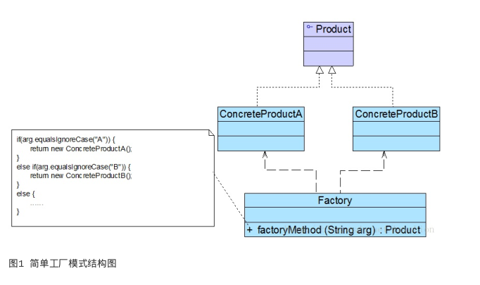

### JAVA开发中的设计模式

**1.什么是设计模式**

> 设计模式（Design pattern）是一套被反复使用、多数人知晓的、经过分类编目的、代码设计经验的总结

**2.设计模式六大原则**
(1) 开闭原则（Open Close Principle）

> 开闭原则就是说对扩展开放，对修改关闭。在程序需要进行拓展的时候，不能去修改原有的代码，实现一个热插拔的效果。所以一句话概括就是：为了使程序的扩展性好，易于维护和升级。想要达到这样的效果，我们需要使用接口和抽象类，后面的具体设计中我们会提到这点。

(2) 里氏代换原则（Liskov Substitution Principle）

> 里氏代换原则(Liskov Substitution Principle LSP)面向对象设计的基本原则之一。 里氏代换原则中说，任何基类可以出现的地方，子类一定可以出现。 LSP是继承复用的基石，只有当衍生类可以替换掉基类，软件单位的功能不受到影响时，基类才能真正被复用，而衍生类也能够在基类的基础上增加新的行为。里氏代换原则是对“开-闭”原则的补充。实现“开-闭”原则的关键步骤就是抽象化。而基类与子类的继承关系就是抽象化的具体实现，所以里氏代换原则是对实现抽象化的具体步骤的规范。

(3) 依赖倒转原则（Dependence Inversion Principle）

> 这个是开闭原则的基础，具体内容：真对接口编程，依赖于抽象而不依赖于具体。

(4) 接口隔离原则（Interface Segregation Principle）

> 这个原则的意思是：使用多个隔离的接口，比使用单个接口要好。还是一个降低类之间的耦合度的意思，从这儿我们看出，其实设计模式就是一个软件的设计思想，从大型软件架构出发，为了升级和维护方便。所以上文中多次出现：降低依赖，降低耦合。

(5) 迪米特法则（最少知道原则）（Demeter Principle）

> 为什么叫最少知道原则，就是说：一个实体应当尽量少的与其他实体之间发生相互作用，使得系统功能模块相对独立。

(6) 合成复用原则（Composite Reuse Principle）

> 原则是尽量使用合成/聚合的方式，而不是使用继承

**3.常用设计模式一览表**

|              类型              |                模式名称                 | 学习难度 | 使用频率 |
| :----------------------------: | :-------------------------------------: | :------: | -------- |
| 创建型模式(Creational Pattern) |       单例模式(Singleton Pattern)       |  ★☆☆☆☆   | ★★★★☆    |
| 创建型模式(Creational Pattern) |  简单工厂模式(Simple Factory pattern)   |  ★★☆☆☆   | ★★★☆☆    |
| 创建型模式(Creational Pattern) |  工厂方法模式(Factory Method Pattern)   |  ★★☆☆☆   | ★★★★★    |
| 创建型模式(Creational Pattern) | 抽象工厂模式( Abstract Factory Pattern) |  ★★★★☆   | ★★★★★    |
| 创建型模式(Creational Pattern) |      原型模式 (Prototype Pattern)       |  ★★★☆☆   | ★★☆☆☆    |
| 创建型模式(Creational Pattern) |       建造者模式(Builder Pattern)       |  ★★★★☆   | ★★☆☆☆    |
| 结构型模式(Structural Pattern) |      适配器模式 (Adapter Pattern)       |  ★★☆☆☆   | ★★★★☆    |
| 结构型模式(Structural Pattern) |        桥接模式 (Bridge Pattern)        |  ★★★☆☆   | ★★★☆☆    |
| 结构型模式(Structural Pattern) |      组合模式 (Composite Pattern)       |  ★★★☆☆   | ★★★★☆    |
| 结构型模式(Structural Pattern) |      装饰模式 (Decorator Pattern)       |  ★★★☆☆   | ★★★☆☆    |
| 结构型模式(Structural Pattern) |        外观模式 (Façade Pattern)        |  ★☆☆☆☆   | ★★★★★    |
| 结构型模式(Structural Pattern) |      享元模式 (Flyweight Pattern)       |  ★★★★☆   | ★☆☆☆☆    |
| 结构型模式(Structural Pattern) |        代理模式 (Proxy Pattern)         |  ★★★☆☆   | ★★★★☆    |
| 行为型模式(Behavioral Pattern) |          职责链模式 (Chain of)          |  ★★★☆☆   | ★★☆☆☆    |
| 行为型模式(Behavioral Pattern) |       命令模式 (Command Pattern)        |  ★★★☆☆   | ★★★★☆    |
| 行为型模式(Behavioral Pattern) |    解释器模式 (Interpreter Pattern)     |  ★★★★★   | ★☆☆☆☆    |
| 行为型模式(Behavioral Pattern) |      迭代器模式 (Iterator Pattern)      |  ★★★☆☆   | ★★★★★    |
| 行为型模式(Behavioral Pattern) |      中介者模式 (Mediator Pattern)      |  ★★★☆☆   | ★★☆☆☆    |
| 行为型模式(Behavioral Pattern) |      备忘录模式 (Memento Pattern)       |  ★★☆☆☆   | ★★☆☆☆    |
| 行为型模式(Behavioral Pattern) |      观察者模式 (Observer Pattern)      |  ★★★☆☆   | ★★★★★    |
| 行为型模式(Behavioral Pattern) |        状态模式 (State Pattern)         |  ★★★☆☆   | ★★★☆☆    |
| 行为型模式(Behavioral Pattern) |       策略模式(Strategy Pattern)        |  ★☆☆☆☆   | ★★★★☆    |
| 行为型模式(Behavioral Pattern) |     模板方法模式 (Template Method)      |  ★★☆☆☆   | ★★★☆☆    |
| 行为型模式(Behavioral Pattern) |      访问者模式 (Visitor Pattern)       |  ★★★★☆   | ★☆☆☆☆    |

### 创建型模式(六个)

**(一)简单工厂模式** 

> 简单工厂模式并不属于23个经典设计模式,但是通常作为学习其他工厂模式的基础,在什么情况下使用简单工厂模式? 需要创建很多对象,并且他们可能拥有一部分公共的相同的特征,并且我们需要根据不同的特征去创建不同的对象

- 定义:

  定义一个工厂,它可以根据参数的不同返回不同类的实例,被创建的实例通常具有共同的父类,因为在简单工厂模式中用于创建实例的方法是静态(static)方法,因此简单工厂模式又被称为静态工厂方法(Static Factory Method)模式,它属于类创建型模式。

- 要点:

  当你需要什么,只需要传入一个正确的参数,就可以获取你所需要的对象,而无须知道其创建细节。简单工厂模式结构比较简单,其核心是工厂类的设计

- 结构图:

  

- 角色划分:

  - Factory 工厂类,将创建类对象的方法抽取出来,用以复用,把创建对象的细节隐藏起来,让调用类无需关心 对象是如何创建的,并且只需要传递不同的参数就可以得到不同的对象
  - Product 产品抽象父类,根据工厂类创建的所有对象的父类,并且将所有子类公共的方法做以抽离,子类根据需要重写父类方法 
  - concreateProduct(具体的子类对象) 这就是我们根据工厂创建出来的目标对象,并且每一个具体的子类对象都应该继承抽象父类,并根据需要重写其父类方法

- 代码实现

  - 抽象产品类

    ```java
    public  abstract class AbstractProduct {
    
        /**
         * 公共的生产汽车的方法
         * @param carName
         * @return
         */
        String createCar(String carName) {
    
            return "create car, car name is " +carName;
        }
    }
    ```

  - 工厂类

    ```java
    public class CarFactory {
    
       static AbstractProduct createProduct(String productName){
    
           AbstractProduct product = null;
    
           if("BM".equals(productName)){
               product = new BMProduct();
           }
           if("AD".equals(productName)){
               product = new ADProduct();
           }
    
           return product;
        }
    }
    ```

  - 具体产品类A

    ```java
    public class ADProduct extends  AbstractProduct {
    
    
        @Override
        String createCar(String carName) {
            return "ADProduct 666"+super.createCar(carName);
        }
    }
    ```

  - 具体产品类B

    ```java
    public class BMProduct extends  AbstractProduct {
    
        @Override
        String createCar(String carName) {
            return "BMProduct "+super.createCar(carName);
        }
    }
    ```

  - 测试类

    ```java
        public static void main(String[] args) {
    
            AbstractProduct ad = CarFactory.createProduct("AD");
            System.out.println( ad.createCar("奥迪A6 ..."));
    
            AbstractProduct bm = CarFactory.createProduct("BM");
            System.out.println(bm.createCar("宝马Q7 ..."));
        }
    ```

- 优点

  工厂类包含必要的判断逻辑,决定在什么时候创建什么样的实例,使得创建实例和使用实例分割,不需要关心对象是如何创建的

- 缺点

  1工厂类集中了比较多的逻辑,一旦不能正常工作,整个系统就会受影响

  2 使用工厂类将会增加系统中类的个数,增加系统的复杂度

  3 系统扩展困难,一旦增加新的产品,就需要修改工厂的逻辑,当产品的类型过多时,有可能造成工厂逻辑过于复杂,不利于系统的扩展和维护