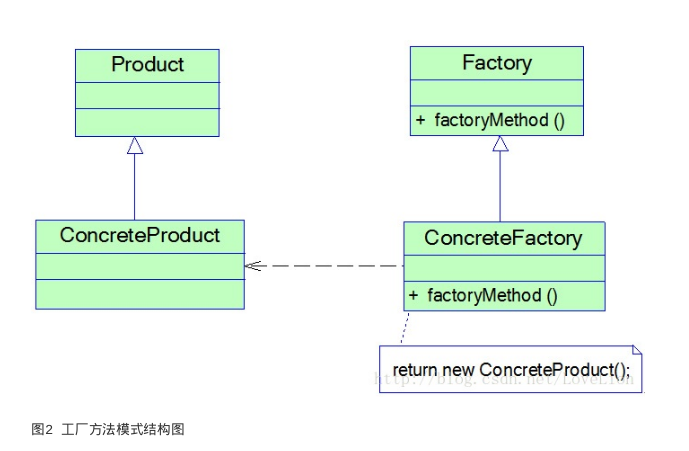

- [工厂方法模式](#%E5%B7%A5%E5%8E%82%E6%96%B9%E6%B3%95%E6%A8%A1%E5%BC%8F)
  - [背景](#%E8%83%8C%E6%99%AF)
  - [概述](#%E6%A6%82%E8%BF%B0)
  - [定义](#%E5%AE%9A%E4%B9%89)
  - [结构图](#%E7%BB%93%E6%9E%84%E5%9B%BE)
  - [角色说明](#%E8%A7%92%E8%89%B2%E8%AF%B4%E6%98%8E)
  - [代码](#%E4%BB%A3%E7%A0%81)
  - [主要优点](#%E4%B8%BB%E8%A6%81%E4%BC%98%E7%82%B9)
  - [主要缺点](#%E4%B8%BB%E8%A6%81%E7%BC%BA%E7%82%B9)

### 工厂方法模式

#### 背景

> 简单工厂模式虽然简单,但是存在一个很严重的问题,当我们系统需要引入新的产品时,由于静态工厂方法根据不同的参数传递创建不同的实例,这需要修改工厂类的代码,违背了'开闭原则',如何解决这个问题? 本文将介绍第二种工厂模式----------工厂方法模式

#### 概述

> 在工厂方法模式中,我们不再提供一个统一的工厂类来创建所有的产品对象,而是针对不同的产品提供不同的工厂,系统提供一个与产品等级结构对应的工厂等级结构

#### 定义

> 定义一个用于创建对象的接口,让子类决定将哪一个类实例化。工厂方法模式让一个类的实例化延迟到其子类。工厂方法模式又简称为工厂模式(Factory Pattern),又可称作虚拟构造器模式(Virtual Constructor Pattern)或多态工厂模式(Polymorphic Factory Pattern)。工厂方法模式是一种类创建型模式

#### 结构图



#### 角色说明

- Product(抽象产品): 定义产品的接口,是工厂方法模式所创建对象的超类型,也就是产品对象的公共父类
- ConcreteProduct(具体产品):它实现了抽象产品接口,某种类型的具体产品由专门的具体工厂创建,具体工厂和具体产品之间一一对应
- Factory(抽象工厂):在抽象工厂类中,声明了工厂方法(Factory Method),用于返回一个产品。抽象工厂是工厂方法模式的核心,所有创建对象的工厂类都必须实现该接口。
- ConcreteFactory(具体工厂):它是抽象工厂类的子类,实现了抽象工厂中定义的工厂方法,并可由客户端调用,返回一个具体产品类的实例

#### 代码

- 统一的抽象产品

```java
public interface Logger {

    /**
     * 写日志
     */
    void writeLog();
}
```

- 统一的产品工厂

```java
public interface LoggerFactory {

    /**
     * 获取日志操作对象
     * @return
     */
     Logger getLogger();
}
```

- db记录日志的工厂

```java
public class DBLoggerFactory implements LoggerFactory {
    @Override
    public Logger getLogger() {

        return new DBLogger();
    }
}
```

- db的产品类

```java
public class DBLogger implements Logger {
    @Override
    public void writeLog() {
        System.out.println("数据库日志记录");
    }
}
```

- 文件记录的日志工厂

```java
public class FileLogFactory implements LoggerFactory {
    @Override
    public Logger getLogger() {
        return new FileLogger();
    }
}
```

- 文件记录的日志产品

```java
public class FileLogger implements Logger {

    @Override
    public void writeLog() {

        System.out.println("文件记录日志....");
    }
}
```

- 测试类

```java
public class TestMain {

    public static void main(String[] args) {
        LoggerFactory factory = new DBLoggerFactory();
        Logger logger = factory.getLogger();
        logger.writeLog();
    }
}
```

#### 主要优点

1. 在工厂方法模式中,工厂方法用来创建客户所需要的产品,同时还向客户隐藏了哪种具体产品类将被实例化这一细节,用户只需要关心所需产品对应的工厂,无须关心创建细节,甚至无须知道具体产品类的类名。
2. 基于工厂角色和产品角色的多态性设计是工厂方法模式的关键。它能够让工厂可以自主确定创建何种产品对象,而如何创建这个对象的细节则完全封装在具体工厂内部。工厂方法模式之所以又被称为多态工厂模式,就正是因为所有的具体工厂类都具有同一抽象父类。
3. 使用工厂方法模式的另一个优点是在系统中加入新产品时,无须修改抽象工厂和抽象产品提供的接口,无须修改客户端,也无须修改其他的具体工厂和具体产品,而只要添加一个具体工厂和具体产品就可以了,这样,系统的可扩展性也就变得非常好,完全符合“开闭原则”。

#### 主要缺点

工厂方法模式的主要缺点如下:

1. 在添加新产品时,需要编写新的具体产品类,而且还要提供与之对应的具体工厂类,系统中类的个数将成对增加,在一定程度上增加了系统的复杂度,有更多的类需要编译和运行,会给系统带来一些额外的开销。
2. 由于考虑到系统的可扩展性,需要引入抽象层,在客户端代码中均使用抽象层进行定义,增加了系统的抽象性和理解难度,且在实现时可能需要用到DOM、反射等技术,增加了系统的实现难度。

