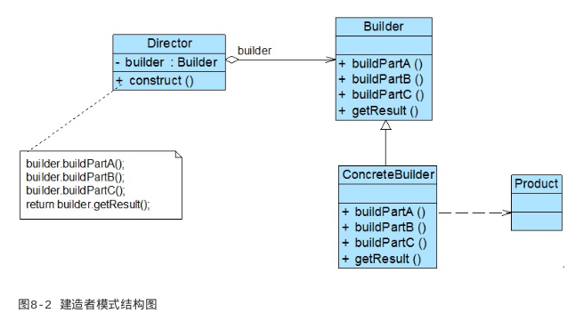

### 建造者模式

#### 背景

> 我们需要创建一个对象,但是它非常复杂,我们如何将这个复杂的条件进行组装,组合成一个可用的对象返回给调用者,这就是建造者模式需要解决的问题

#### 概述

> 建造者模式是较为复杂的创建型模式,它将客户端与包含多个组成部分(或部件)的复杂对象的创建
> 过程分离,客户端无须知道复杂对象的内部组成部分与装配方式,只需要知道所需建造者的类型即
> 可。它关注如何一步一步创建一个的复杂对象,不同的具体建造者定义了不同的创建过程,且具体建
> 造者相互独立,增加新的建造者非常方便,无须修改已有代码,系统具有较好的扩展性。

#### 定义

> 将一个复杂对象的构建与它的表示分离,使得同样的构建过程可
> 以创建不同的表示。建造者模式是一种对象创建型模式

#### 结构图

#### 角色说明

● Builder(抽象建造者):它为创建一个产品Product对象的各个部件指定抽象接口,在该接口中
一般声明两类方法,一类方法是buildPartX(),它们用于创建复杂对象的各个部件;另一类方法是
getResult(),它们用于返回复杂对象。Builder既可以是抽象类,也可以是接口。
●ConcreteBuilder(具体建造者):它实现了Builder接口,实现各个部件的具体构造和装配方
法,定义并明确它所创建的复杂对象,也可以提供一个方法返回创建好的复杂产品对象。
● Product(产品角色):它是被构建的复杂对象,包含多个组成部件,具体建造者创建该产品的内

部表示并定义它的装配过程。
● Director(指挥者):指挥者又称为导演类,它负责安排复杂对象的建造次序,指挥者与抽象建
造者之间存在关联关系,可以在其construct()建造方法中调用建造者对象的部件构造与装配方法,
完成复杂对象的建造。客户端一般只需要与指挥者进行交互,在客户端确定具体建造者的类型,并实
例化具体建造者对象(也可以通过配置文件和反射机制),然后通过指挥者类的构造函数或者Setter
方法将该对象传入指挥者类中

#### 代码

#### 主要优点

建造者模式的主要优点如下:
(1) 在建造者模式中,客户端不必知道产品内部组成的细节,将产品本身与产品的创建过程解耦,使
得相同的创建过程可以创建不同的产品对象。
(2) 每一个具体建造者都相对独立,而与其他的具体建造者无关,因此可以很方便地替换具体建造者
或增加新的具体建造者,用户使用不同的具体建造者即可得到不同的产品对象。由于指挥者类针对抽
象建造者编程,增加新的具体建造者无须修改原有类库的代码,系统扩展方便,符合“开闭原则”
(3) 可以更加精细地控制产品的创建过程。将复杂产品的创建步骤分解在不同的方法中,使得创建过
程更加清晰,也更方便使用程序来控制创建过程。

#### 主要缺点

(1) 建造者模式所创建的产品一般具有较多的共同点,其组成部分相似,如果产品之间的差异性很
大,例如很多组成部分都不相同,不适合使用建造者模式,因此其使用范围受到一定的限制。
(2) 如果产品的内部变化复杂,可能会导致需要定义很多具体建造者类来实现这种变化,导致系统变
得很庞大,增加系统的理解难度和运行成本。