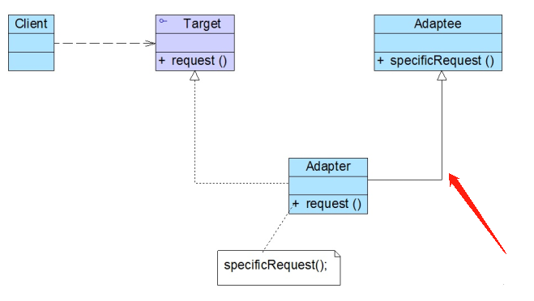
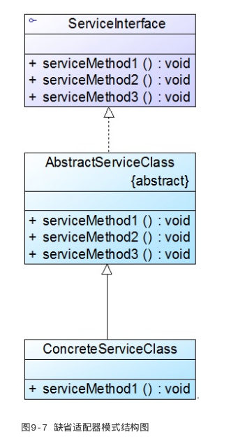

### 适配器模式

#### 背景

> 在软件开发中,有时会存在在结构上不兼容的情况,我们需要在结构上通过协调去兼容这些结构,使他们共同协作,这种设计模式称为适配器模式,适配器模式属于结构型模式

#### 概述

> 与电源适配器相似,在适配器模式中引入了一个被称为适配器(Adapter)的包装类,而它所包装的对象称为适配者(Adaptee),即被适配的类。适配器的实现就是把客户类的请求转化为对适配者的相应接口的调用。也就是说:当客户类调用适配器的方法时,在适配器类的内部将调用适配者类的方法,而这个过程对客户类是透明的,客户类并不直接访问适配者类。因此,适配器让那些由于接口不兼容而不能交互的类可以一起工作。适配器模式可以将一个类的接口和另一个类的接口匹配起来,而无须修改原来的适配者接口和抽象目标类接口

#### 定义

> 将一个接口转换成客户希望的另一个接口,使接口不兼容的那些类可以一起工作,其别名为包装器(Wrapper)。适配器模式既可以作为类结构型模式,也可以作为对象结构型模式

#### 结构图


#### 角色说明

● Target(目标抽象类):目标抽象类定义客户所需接口,可以是一个抽象类或接口,也可以是具
体类。
● Adapter(适配器类):适配器可以调用另一个接口,作为一个转换器,对Adaptee和Target进
行适配,适配器类是适配器模式的核心,在对象适配器中,它通过继承Target并关联一个Adaptee
对象使二者产生联系。
● Adaptee(适配者类):适配者即被适配的角色,它定义了一个已经存在的接口,这个接口需要适
配,适配者类一般是一个具体类,包含了客户希望使用的业务方法,在某些情况下可能没有适配者类
的源代码。

> 根据对象适配器模式结构图,在对象适配器中,客户端需要调用request()方法,而适配者类Adaptee没有该方法,但是它所提供的specificRequest()方法却是客户端所需要的。为了使客户端能够使用适配者类,需要提供一个包装Adapter,即适配器类。这个包装类包装了一个适配者的实例,从而将客户端与适配者衔接起来,在适配器的request()方法中调用适配者的specificRequest()方法。因为适配器类与适配者类是关联关系(也可称之为委派关系),所以这种适配器模式称为对象适配器模式

#### 类适配器

> 除了对象适配器模式之外,适配器模式还有一种形式,那就是类适配器模式,类适配器模式和对象适配器模式最大的区别在于适配器和适配者之间的关系不同,对象适配器模式中适配器和适配者之间是关联关系,而类适配器模式中适配器和适配者是继承关系

#### 类适配器结构图



#### 双向适配器

> 在对象适配器的使用过程中,如果在适配器中同时包含对目标类和适配者类的引用,适配者可以通过它调用目标类中的方法,目标类也可以通过它调用适配者类中的方法,那么该适配器就是一个双向适配器

#### 双向适配器结构图


#### 缺省适配器

> 缺省适配器模式(Default Adapter Pattern):当不需要实现一个接口所提供的所有方法时,可先设计一个抽象类实现该接口,并为接口中每个方法提供一个默认实现(空方法),那么该抽象类的子类可以选择性地覆盖父类的某些方法来实现需求,它适用于不想使用一个接口中的所有方法的情况,又称为单接口适配器模式

#### 缺省适配器结构图



#### 代码

- 适配器

```java
public class OperationAdapter implements ScoreOperation {

    /**
     *     定义适配者QuickSort对象
     */
    private QuickSort sortObj;

    /**
     * 定义适配者BinarySearch对象
     */
    private BinarySearch searchObj;

    public OperationAdapter(){
    sortObj = new QuickSort();
    searchObj = new BinarySearch();

    }

    @Override
    public int[] sort(int[] array) {
        return sortObj.quickSort(array);
    }

    @Override
    public int search(int[] array, int key) {
        return searchObj.binarySearch(array,key);
    }
}
```

- 适配者

```java
public class QuickSort {

    public int[] quickSort(int array[]) {
         sort(array,0,array.length-1);
         return array;

    }

    public void sort(int array[],int p, int r) {
        int q=0;

        if(p<r) {
            q=partition(array,p,r);
            sort(array,p,q-1);
            sort(array,q+1,r);


        }
    }


    public int partition(int[] a, int p, int r) {
        int x=a[r];
        int j=p-1;
        for (int i=p;i<=r-1;i++) {

            if (a[i]<=x) {
                j++;
                swap(a,j,i);

            }
        }
        swap(a,j+1,r);


        return j+1;
    }


    public void swap(int[] a, int i, int j) {
        int t = a[i];
        a[i] = a[j];
        a[j] = t;

    }
}

//二分查找类:适配者
class BinarySearch {

    public int binarySearch(int array[],int key) {
        int low = 0;
        int high = array.length -1;
        while(low <= high) {
            int mid = (low + high) / 2;
            int midVal = array[mid];
            if(midVal < key) {
                low = mid +1;
            }

            else if (midVal > key) {
                high = mid -1; }
            else {
                return 1; //找到元素返回1
            }
        }
        return -1;

//未找到元素返回-1
    }

}

```

- 目标接口

```java
public interface ScoreOperation {

    int [] sort(int[] array);

    int search(int[] array,int key);

}
```

- 测试类

```java
    public static void main(String[] args) {

        ScoreOperation operation;
        operation = new OperationAdapter();

        int scores[] = {84,76,50,69,90,91,88,96};

        int[] sort = operation.sort(scores);

        for (int i : sort) {
            System.out.println(i);
        }


        int search = operation.search(scores, 50);
        System.out.println(search);
    }
```

#### 主要优点

(1) 将目标类和适配者类解耦,通过引入一个适配器类来重用现有的适配者类,无须修改原有结构。
(2) 增加了类的透明性和复用性,将具体的业务实现过程封装在适配者类中,对于客户端类而言是透
明的,而且提高了适配者的复用性,同一个适配者类可以在多个不同的系统中复用。
(3) 灵活性和扩展性都非常好,通过使用配置文件,可以很方便地更换适配器,也可以在不修改原有
代码的基础上增加新的适配器类,完全符合“开闭原则”。

具体来说,类适配器模式还有如下优点:
由于适配器类是适配者类的子类,因此可以在适配器类中置换一些适配者的方法,使得适配器的灵活
性更强。
对象适配器模式还有如下优点:
(1) 一个对象适配器可以把多个不同的适配者适配到同一个目标;
(2) 可以适配一个适配者的子类,由于适配器和适配者之间是关联关系,根据“里氏代换原则”,适配
者的子类也可通过该适配器进行适配。

#### 主要缺点

类适配器模式的缺点如下:
(1) 对于Java、C#等不支持多重类继承的语言,一次最多只能适配一个适配者类,不能同时适配多
个适配者;
(2) 适配者类不能为最终类,如在Java中不能为final类,C#中不能为sealed类;
(3) 在Java、C#等语言中,类适配器模式中的目标抽象类只能为接口,不能为类,其使用有一定的
局限性。
对象适配器模式的缺点如下:
与类适配器模式相比,要在适配器中置换适配者类的某些方法比较麻烦。如果一定要置换掉适配者类
的一个或多个方法,可以先做一个适配者类的子类,将适配者类的方法置换掉,然后再把适配者类的
子类当做真正的适配者进行适配,实现过程较为复杂。